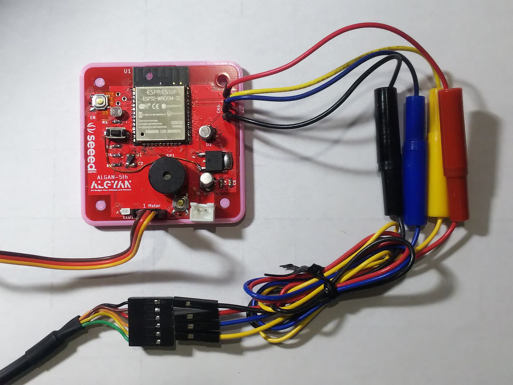
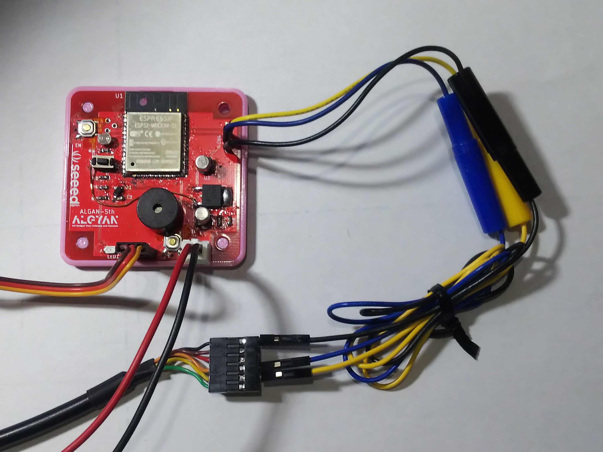

# はじめに  
本プログラムは、IoT ALGYAN ５周年基板のハードウェアチェックソフトです。  
基板に部品をはんだ付け実装した後の動作チェックに使用いただけます。  

基板に実装したハードウェアが問題なく動作することを確認するための最低限の機能を実装したものです。

# 重要
作成したばかりの基板は、そのまま電源を入れると部品を破損させたり、
思わぬところで動かなくてはまったりします。  

基板のチェックを十分にしてから電源を入れるようにしてください。
何をチェックしたらいいかがわからない人は、以下を参考にして下さい（壊さないための最低限のチェックです）。

- ESP32のブリッジチェック

> ブリッジしている場所によって何が起こるかわかりません。すべてのピンで隣のピン同士をテスタで導通チェックします

- 電源 (CN1) の抵抗値チェック

> ショートしていると抵抗値０になり、電源やUSBシリアルケーブル（下手するとPC）を壊す場合があります。

- 電源 (レギュレータ Gnd-3pin) の抵抗値チェック（同上）

> ショートしていると抵抗値０になり、そのまま電源入れるとレギュレータが壊れる場合があります。

- SW1 の修正ジャンパー接続側と CN1-1pin

> 基板修正の際に裏側のパターンカットをしたと思いますが、導通がある場合カットが不十分の可能性があります。

# 環境準備
前提条件として以下が設定出来ている事とします。

### 1. 開発環境 ※
Arduino IDE がインストールされていること。  

### 2. USBシリアルドライバ
使用する USBシリアルの種類によってことなりますので、自身でインストールし認識されるようにしておいてください。

### 3. ボードマネージャー ※
Arduino IDE のボードマネージャーに "ESP32" が登録されていることが前提です。 

### 4. ライブラリ
以下を使用します。入っていない場合はコンパイルエラーになりますので、[ツール] - [ライブラリを管理] で、ライブラリマネージャを開き、右上の検索枠に下記検索ワードを入れて検索し、インストールしてください。

#### ・ServoESP32 by JarekParal
"Servo ESP32" で検索  

※
Arduino IDE で ESP32 やM5シリーズ(M5Stack, M5Stick-C, M5ATOM 等) を書き込んだことがある場合はたぶん大丈夫ですが、それ以外の方は "esp32 arduino セットアップ" 等と検索して、あらかじめインストール・設定してください。

参考に Switch Science 様のサイトのリンクを載せておきますが、もっとわかりやすいページがあるかもしれません。  
<https://trac.switch-science.com/wiki/esp32_setup>

# 書き込み準備(接続)

書き込みにはUSBシリアルケーブルが必要です。 
信号レベルが3.3Vで、最低限 GND, TX, RX の３つの信号があれば書き込めます。（全ての種類のケーブルを保証するものではありませんが）

### ①USBシリアルケーブルから電源を取る場合

以下の場合に使用します。  
・USBシリアルケーブルに 5V がある場合  

表のように TX-RXどおしをクロスして配線します。
| Althan5th基板 |　| USBシリアル |
|:---:|:---:|:---:|
|CN4_1(VDD) |－ |5V|
|CN4_2(TXD) |－ |RX|
|CN4_3(RXD) |－ |TX|
|CN4_4(GND) |－ |Gnd|

### ②電源コネクタ(CN1)から電源を取る場合

以下の場合に使用します。  
・そもそもUSBシリアルケーブルに 5V がない場合  
・USBシリアルの電源の許容量が少ない、書き込み中に電源が落ちて不安定になる場合等  
表のように TX-RXどおしをクロスして配線します。CN4 -> CN1 の順でつなぐといいかと思います。

| Althan5th基板 |　| USBシリアル |
|:---:|:---:|:---:|
|CN4_1(VDD) |Open|-|
|CN4_2(TXD) |－ |RX|
|CN4_3(RXD) |－ |TX|
|CN4_4(GND) |－ |Gnd|

| Althan5th基板 |　| 5V電源 |
|:---:|:---:|:---:|
|CN1_1(5V) |－|+|
|CN1_2(GND) |－|-|

#書き込み手順

### 1. ArduinoIDE を起動

github からダウンロードした、ALGYAN5_TestApp.ino をダブルクリックして起動します。

### 2. ボードマネージャーでボードを選択
ArduinoIDE の [ツール] - [ボード： xxxx] - [ボードマネージャ] - [ESP32 DEV Module] を選択します。(xxxx は現在選択されているボード)

### 3. シリアルポートの選択
ArduinoIDE の [ツール] - [シリアルポート] で、接続した USBシリアルケーブルを選択します。

### 4. 書き込みモードに変更

基板の SW3 を押したままの状態で、SW2 を押して離すと書き込みモードになります。

### 5. 書き込み

[スケッチ] - [マイコンボードに書き込む] と押すと、コンパイルが始まり、エラーが無ければそのまま、書き込みが始まります。 
一番下の窓に以下のように表示されたら完了です。

~~~
Hash of data verified.

Leaving...
Hard resetting via RTS pin...
~~~

以下の様に表示された場合は、4. の手順でちゃんと書き込みモードになっていないか、USBシリアルとの接続が間違っていると思われます。USBシリアルとの接続に問題ない場合は、 SW2, SW3, R4 のあたりに問題がある可能性があります。

~~~
Connectig........_____....._____....._____....._____....._____....._____.....

A fatal error occurred: Failed to connect to ESP32: Timed out waiting for packet header
~~~

## 6. リセットして実行

自動リセットは実装されていないので SW2(RESET) を押してリセットする。

# 動作確認
### 1.SW2 + SW3

プログラムを書き込める事が動作確認になります。  

> 書き込みができない（書き込みモードにならない）場合は、この二つのスイッチ周りに問題があると思われます。(SW2, SW3, R4 をチェック)

### 2.WiFi機能
[ツール] - [シリアルモニター]  左下のボーレート設定は 115200bps 
この状態でリセットすると、周りにあるWiFiのアクセスポイントをスキャンして結果をシリアルモニタに表示します。あくまでもハードチェック用なので、スキャンするだけで接続はしません。

> これが動かない場合は、ESP32が半田ブリッジしてしまっているか壊した可能性があります。(U1をチェック)

### 3.LED + SW1 + ブザー
SW1を押すとブザーにてキー操作音が ピッと鳴ります。  
また、LED の消灯・点灯 状態を切り替えます。  

> 押しても何も行らない場合は SW1周りに問題があると思います。SW1 の両端をピンセット等でショートして反応がある場合は、SW1 の半田不良か壊した可能性があります。(SW1, R2, 基板修正ジャンパー線をチェック)   
> 音はなるけど、LEDが光らない場合は LED の向きが逆か、部品の実装不良かと思います。(LED1, R3　をチェック)
> 音だけがならない場合は、ブザー回りの問題です (SP1, D1 をチェック)

### 4.明るさセンサー(CDS) + サーボモーター  
CDSセンサーに懐中電灯などの光をあててみてください。  
暗い場所で 0°明るい場所で180°まで、サーボモータの角度が変わります。（サーボのホーンはつけておかないとわかりにくいかもしれません）  
また、SW1 を押し LEDが点灯している状態で、シリアルにはセンサーの値を出力しています。  
シリアルモニターを一旦閉じてシリアルプロッターを開くとグラフが表示されます。  

> サーボが動かない場合シリアルプロッタを開いて確認します。  
LED点灯中にグラフに変化がある場合はサーボモータ側の問題、無い場合は CDS の問題です。
> サーボモータが問題の場合 (CN3 の接続向き等をチェック)
> CDSが問題の場合 (U3をチェック)

# 利用について
再配布・改変・これをベースにした開発等、ご自由にどうぞ。

Auther: 佐野 岳志 (TakSan)
