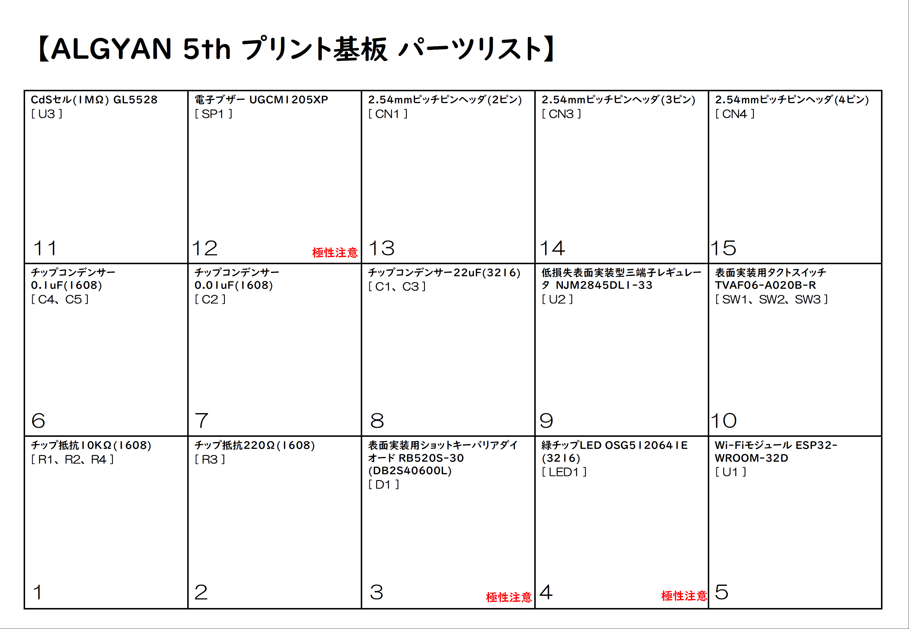

# ALGYAN 5th IoT基板はんだ付けマニュアル

---

### 目次

* [事前準備](#S-0)
  * [S-1 道具の確認](#S-1)
  * [S-2 部品の確認](#S-2)
* [1. 部品のはんだ付け](#1-0)
  * [1-1 チップ抵抗(R1、R2、R3、R4)](#1-1)
  * [1-2 ショットキーバリアダイオード(D1)](#1-2)
  * [1-3 緑チップLED(LED1)](#1-3)
  * [1-4 Wi-Fiモジュール ESP32-WROOM-32D(U1)](#1-4)
  * [1-5 チップコンデンサ(C1、C2、C3、C4、C5)](#1-5)
  * [1-6 3端子レギュレーター(U2)](#1-6)
  * [1-7 表面実装タクトスイッチ(SW1、SW2、SW3)](#1-7)
  * [1-8 CdSセル(U3)](#1-8)
  * [1-9 電子ブザー(U3)](#1-9)
  * [1-10 ヘッダピン(CN1、CN3、CN4)](#1-10)
* [2. 基板の改修](#2-0)
  * [2-1 パターンカット](#2-1)
  * [2-2 ジャンパーワイヤはんだ付け](#2-2)
* [3. 動作確認](../Algyan5thBoard_HwTestApp/readme.md)

---

## <a name="S-0">事前準備</a>

まずは、ALGYAN5th IoT基板に電子部品をはんだ付けして完成させるために必要な準備を行います。

### <a name="S-1">S-1 道具の確認</a>

#### ・絶対必要なもの(道具＆部品)

1. ALGYAN5th IoT基板 - 5周年記念ケースからは外しておいて下さい
1. 5周年基板用電子部品一式 - 個別に購入した部品でもOK
1. はんだごて - 先の細い20W～30W程度の電子部品はんだ付け用
1. こて台
1. やに入りはんだ線 - できるだけ細いものを推奨(できればΦ0.4mmぐらい、Φ0.8mm以下)
1. ピンセット - 先の尖ったもの

---

#### ・あると良い道具、その他

1. ルーペ
1. ニッパ
1. ラジオペンチ
1. ワイヤーストリッパー
1. カッターナイフ
1. アクリルカッター
1. ルーペ付き作業台

---

#### ・基板改修、補修などに利用するもの

1. 耐熱電子ワイヤー(より線)
1. 耐熱電子ワイヤー(単芯線)
1. ポリウレタン銅線
1. はんだ吸い取り線
1. スペーサー(10mm以上オスメス)4本

線材は、いずれかが50mm程度あればOKです。  
スペーサーは、ヘッダピンのはんだ付け時に使います(なくても出来ますが、これを使うと楽になります)。  
その他、[フラックスペン](https://www.amazon.co.jp/dp/B00SKSJFZA)や[ブラックスクリーナー](https://www.amazon.co.jp/dp/B003B36VWY/)などもあると良いです。

---

#### ・動作確認に利用するもの

1. USB-シリアル変換(5V/3.3V両用) - ESP32-WROOM-32Dへのプログラム書き込みなどに使います
1. サーボモーターSG90

---

### <a name="S-2">S-2 部品の確認</a>

* "ALGYAN-5th_board_parts_list.pdf"を印刷して、パーツに不足がないか確認をしましょう。

  * ALGYAN-5th_board_parts_list.pdf

---

#### ・若松通商のパーツ一式を開けて並べた状態

#### ・さらにチップ部品などを袋から出して並べた状態

---

## <a name="1-0">1. 部品のはんだ付け</a>

### <a name="1-1">1-1 チップ抵抗(R1、R2、R3、R4)</a>

### <a name="1-2">1-2 ショットキーバリアダイオード(D1)</a>

### <a name="1-3">1-3 緑チップLED(LED1)</a>

### <a name="1-4">1-4 Wi-Fiモジュール ESP32-WROOM-32D(U1)</a>

### <a name="1-5">1-5 チップコンデンサ(C1、C2、C3、C4、C5)</a>

### <a name="1-6">1-6 3端子レギュレーター(U2)</a>

### <a name="1-7">1-7 表面実装タクトスイッチ(SW1、SW2、SW3)</a>

### <a name="1-8">1-8 CdSセル(U3)</a>

### <a name="1-9">1-9 電子ブザー(U3)</a>

### <a name="1-10">1-10 ヘッダピン(CN1、CN3、CN4)</a>

---

## <a name="2-0">2. 基板の改修</a>

### <a name="2-1">2-1 パターンカット</a>

### <a name="2-2">2-2 ジャンパーワイヤはんだ付け</a>

---
