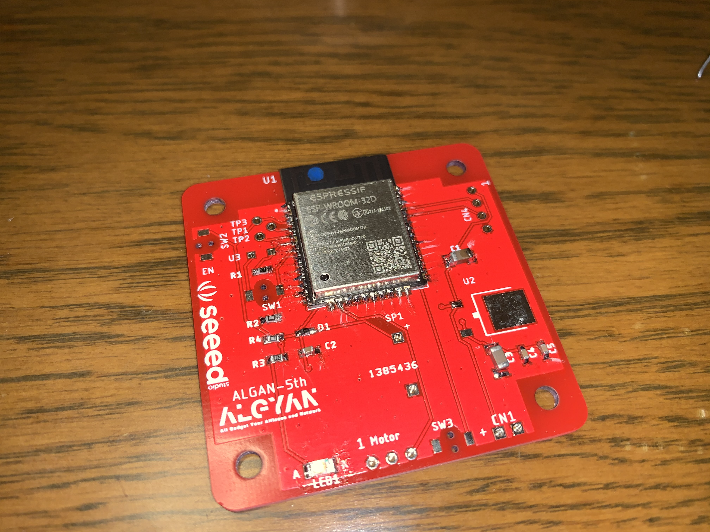

# ALGYAN 5th IoT基板はんだ付けマニュアル

---

### 目次

* [事前準備](#S-0)
  * [S-1 道具の確認](#S-1)
  * [S-2 部品の確認](#S-2)
* [1. 部品のはんだ付け](#1-0)
  * [1-1 チップ抵抗(R1、R2、R3、R4)](#1-1)
  * [1-2 ショットキーバリアダイオード(D1)](#1-2)
  * [1-3 緑チップLED(LED1)](#1-3)
  * [1-4 Wi-Fiモジュール ESP32-WROOM-32D(U1)](#1-4)
  * [1-5 チップコンデンサ(C1、C2、C3、C4、C5)](#1-5)
  * [1-6 3端子レギュレーター(U2)](#1-6)
  * [1-7 表面実装タクトスイッチ(SW1、SW2、SW3)](#1-7)
  * [1-8 CdSセル(U3)](#1-8)
  * [1-9 電子ブザー(SP1)](#1-9)
  * [1-10 ヘッダピン(CN1、CN3、CN4)](#1-10)
* [2. 基板の改修](#2-0)
  * [2-1 パターンカット](#2-1)
  * [2-2 ジャンパーワイヤはんだ付け](#2-2)
* [3. 動作確認](../Algyan5thBoard_HwTestApp)

---

## <a name="S-0">事前準備</a>

まずは、ALGYAN5th IoT基板に電子部品をはんだ付けして完成させるために必要な準備を行います。

### <a name="S-1">S-1 道具の確認</a>

#### ・絶対必要なもの(道具＆部品)

1. ALGYAN5th IoT基板 - 5周年記念ケースからは外しておいて下さい
1. 5周年基板用電子部品一式 - 個別に購入した部品でもOK
1. はんだごて - 先の細い20W～30W程度の電子部品はんだ付け用
1. こて台
1. やに入りはんだ線 - できるだけ細いものを推奨(できればΦ0.4mmぐらい、Φ0.8mm以下)
1. ピンセット - 先の尖ったもの

---

#### ・あると良い道具、その他

1. ルーペ
1. ニッパ
1. ラジオペンチ
1. ワイヤーストリッパー
1. カッターナイフ
1. アクリルカッター
1. ルーペ付き作業台

---

#### ・基板改修、補修などに利用するもの

1. 耐熱電子ワイヤー(より線)
1. 耐熱電子ワイヤー(単芯線)
1. ポリウレタン銅線
1. はんだ吸い取り線
1. スペーサー(10mm以上オスメス)4本

線材は、いずれかが50mm程度あればOKです。  
スペーサーは、ヘッダピンのはんだ付け時に使います(なくても出来ますが、これを使うと楽になります)。  
その他、[フラックスペン](https://www.amazon.co.jp/dp/B00SKSJFZA)や[ブラックスクリーナー](https://www.amazon.co.jp/dp/B003B36VWY/)などもあると良いです。

---

#### ・動作確認に利用するもの

1. USB-シリアル変換(5V/3.3V両用) - ESP32-WROOM-32Dへのプログラム書き込みなどに使います
1. サーボモーターSG90

---

### <a name="S-2">S-2 部品の確認</a>

* "ALGYAN-5th_board_parts_list.pdf"を印刷して、パーツに不足がないか確認をしましょう。

  * [ALGYAN-5th_board_parts_list.pdf](ALGYAN-5th_board_parts_list.pdf)

---

#### ・若松通商のパーツ一式を開けて並べた状態

#### ・さらにチップ部品などを袋から出して並べた状態

---

## <a name="1-0">1. 部品のはんだ付け</a>

部品のはんだ付けは、高さが低く、小さな部品から、また同じ種類、型式のものをまとめて行っていくと間違いが少なくできます。  
なので今回は、パーツリストの左下の部品(R1、R2、R4)から右に並んだ部品をはんだ付けし、横一列が終わったらその上の横一列の順に行っていく形になります。

### <a name="1-1">1-1 チップ抵抗(R1、R2、R3、R4)</a>

まずチップ抵抗のはんだ付けにおいては、片側のランド(※)に予備はんだを盛ります。  
予備はんだを盛るランドは、GNDのようなベタパターンと繋がっていない方に行います。  
(ベタパターンと繋がっているランドには、はんだごての熱が伝わりにくく、はんだが載りにくいので避けます。)  

※)ランドとは、部品の取り付け及び接続に用いる導体パターンのことです。  
　表面実装用場合は「パッド」と呼ぶこともあります。

予備はんだを盛り終わったら、部品リスト上に並べたチップ抵抗(R1、R2、R3、R4)をピンセットで摘まみながら位置合わせを行って予備はんだをしたランド側からはんだ付けを行います。  
チップ抵抗には、表と裏があります。3桁の数字が書いてある黒い面が表で、白い面は裏です。  
表裏を逆にはんだ付けしても、動作には影響ありませんが、表面が見えるようにはんだ付けしましょう。  
片側のはんだ付けが出来たら、反対側をはんだ付けします。  
R1、R2、R4とR3は、抵抗値が異なるので、部品を間違えないようにして下さい。

以下の写真は、R1～R4のランドに予備はんだを盛った状態です。

以下の写真は、チップ抵抗(R1、R2、R3、R4)のはんだ付けが終わった状態です。

---

### <a name="1-2">1-2 ショットキーバリアダイオード(D1)</a>

ショットキーバリアダイオード(D1)のはんだ付けにおいても、チップ抵抗と同様に片側のランドに予備はんだを盛ります。  

以下の写真は、D1とその次にはんだ付けするLED1のランドに予備はんだを盛った状態です。

ショットキーバリアダイオード(D1)には、方向があります。  
下の写真のようにカソード側にマークがついています。  
残念ながら5周年基板のD1シルクには、アノード/カソードを示すものがありません。  
カソードがD1の文字と反対側に来るようにはんだ付けします。

---

### <a name="1-3">1-3 緑チップLED(LED1)</a>

緑チップLED(LED1)のはんだ付けにおいても、チップ抵抗と同様に片側のランドに予備はんだを盛ります。  
緑チップLED(LED1)にも、方向があります。  
下の写真のようにカソード側にマークがついています。  
カソードがKの文字の方に来るようにはんだ付けします。

以下の写真は、緑チップLED(LED1)までのはんだ付けが終わった状態です。

---

### <a name="1-4">1-4 Wi-Fiモジュール ESP32-WROOM-32D(U1)</a>

次は大物のWi-Fiモジュール ESP32-WROOM-32D(U1)のはんだ付けです。
これも、チップ抵抗と同様に予備はんだを盛りますが、盛る場所はまずGNDに繋がるピンを避け、角に近い2ピン、16ピン、25ピンの3ヶ所だけにして、位置がずれないように注意しながらはんだ付けして行きます。  

以下の写真は、2ピン、16ピン、25ピンの3ヶ所のランドに予備はんだを盛った状態です。

位置ずれなく、3ヶ所のピンのはんだ付けが出来たら、残りのピンをはんだ付けしていきます。  
このモジュールのはんだ付けには、[フラックスペン](https://www.amazon.co.jp/dp/B00SKSJFZA)を使うと綺麗に出来上がります。  
また[回路図](../BoardInfo/Algyan-5th-01.pdf)を見ると分かりますが、この基板では全ピン使用していないので、使用しているピンのみのはんだ付けでも、動作上は問題ありません。
* 使用しているピン
  * 1～7ピン、13～16ピン、25ぴｎ、34ピン、35ピン，38ピン

このWi-Fiモジュール ESP32-WROOM-32D(U1)各端子のはんだ付けについては、**ルーペを使って念入りに確認**して下さい。  
隣のピンとのショートがあるまま通電すると、**モジュールを破損**することがあります。  
この後の部品をはんだ付けした後は、このモジュールの各端子のはんだ付けを修復することが困難になります。

以下の写真は、全ピンのはんだ付けが終わった状態です。

---

### <a name="1-5">1-5 チップコンデンサ(C1、C2、C3、C4、C5)</a>

今まで同様にチップコンデンサのはんだ付けにおいても、片側のランドに予備はんだを盛ります。  

予備はんだを盛り終わったら、部品リスト上に並べたチップコンデンサ(C1、C2、C3、C4、C5)をピンセットで摘まみながら位置合わせを行って予備はんだをしたランド側からはんだ付けを行います。  

チップコンデンサには、表と裏がありません。  
表裏の向きは気にせずはんだ付けできます。  
片側のはんだ付けが出来たら、反対側をはんだ付けします。  
C2とC4、C5は、コンデンサ容量値が異なるので、部品を間違えないようにして下さい。  
(C1、C2も他のチップコンデンサとは容量が異なりますが、サイズも違うので、間違うことは少ないです。)  

以下の写真は、チップコンデンサ(C2、C4、C5)のランドに予備はんだを盛った状態です。

以下の写真は、チップコンデンサ(C2、C4、C5)のはんだ付けが終わった状態です。

以下の写真は、続いてチップコンデンサ(C1、C3)のランドに予備はんだを盛った状態です。

以下の写真は、チップコンデンサ(C1、C3)までのはんだ付けが終わった状態です。

---

### <a name="1-6">1-6 3端子レギュレーター(U2)</a>

今まで同様に3端子レギュレーター(U2)のはんだ付けにおいても、1つのランドに予備はんだを盛ります。  

予備はんだを盛り終わったら、部品リスト上に並べた3端子レギュレーター(U2)をピンセットで摘まみながら位置合わせを行って予備はんだをしたランド側からはんだ付けを行います。  

以下の写真は、3端子レギュレーター(U2)のランドに予備はんだを盛った状態です。

以下の写真は、3端子レギュレーター(U2)までのはんだ付けが終わった状態です。

---

### <a name="1-7">1-7 表面実装タクトスイッチ(SW1、SW2、SW3)</a>

表面実装タクトスイッチ(SW1、SW2、SW3)は、裏面に小さなピンが出ています。  
このピンを基板の穴に嵌められるため、**予備はんだをせずにはんだ付け**を行います。  

以下の写真は、表面実装タクトスイッチ(SW1、SW2、SW3)までのはんだ付けが終わった状態です。

---

### <a name="1-8">1-8 CdSセル(U3)</a>

CdSセル(U3)は、方向のないリード部品です。  
基板の穴にリードを差し込んで、裏から出たリードをすこし外側に広げて余分なリードをニッパで切断します。  
切断した上で、裏面からリードをはんだ付けします。  
写真では、作業台を使って基板を挟んだ状態になっていますが、作業台は使わなくてもOKです。

以下の写真は、CdSセル(U3)を基板の穴に差し込んだ状態です。

以下の写真は、CdSセル(U3)を基板の穴に差し込んだのを裏から見た状態です。

以下の写真は、CdSセル(U3)の余分なリードを切断した状態です。

以下の写真は、CdSセル(U3)のはんだ付けが終わった状態です。

---

### <a name="1-9">1-9 電子ブザー(SP1)</a>

電子ブザー(SP1)は、方向があるリード部品です。  
電子ブザー(SP1)の上部に貼ってあるシールの「+」の方のリードを基板上の「+」のシルクに合わせて基板の穴にリードを差し込みます。  
その上で、裏から出たリードをすこし外側に広げて余分なリードをニッパで切断し、裏面からリードをはんだ付けします。  

以下の写真は、電子ブザー(SP1)のはんだ付けまでが終わった状態です。

---

### <a name="1-10">1-10 ヘッダピン(CN1、CN3、CN4)</a>

ヘッダピン(CN1、CN3、CN4)は、方向のない部品ですが、端子が太いため、他のリード部品のようにはんだ付け前に基板に仮固定が難しい部品です。  
なので、今回はここでスペーサーを使ってみます。  
まず、スペーサーを基板の4ヶ所の穴に差しナットで締めます。  
また、ヘッダピンを取り付け、ティッシュペーパーなどで、押さえて基板を裏返します。  
この状態で、まず裏からピンの各1本だけをはんだ付けします。
各1本のはんだ付けが終わったら、ヘッダピンが真っ直ぐはんだ付けできているか、確認します。  
曲がっている場合は、この段階で修正します。  
全てが真っ直ぐはんだ付けできたら、残りのピンをはんだ付けします。  

以下の写真は、ヘッダピン(CN1、CN3、CN4)とスペーサー4本を取り付けた状態です。

以下の写真は、さらにティッシュペーパーで、押さえて基板を裏返した状態です。

---

## <a name="2-0">2. 基板の改修</a>

ALGYAN5th IoT基板には、1ヶ所の些細な回路設計ミスが見つかりました。  
些細な設計ミスの具体的な内容は、CdSセルのセンサ値の読み取りで、暗くなる方の値が飽和し、上手く取得できない場合が出てしまいことです。  
そのため、利用するためにパターンカットとジャンパーワイヤーの取り付けが必要となりました。  
(このような些細な設計ミスなので、この基板の改修は必須ではありません。)

---

### <a name="2-1">2-1 パターンカット</a>

パターンカットする場所は、以下の写真の黄色の丸で囲んだ辺りになります。  
この細いパターンをカッターナイフまたはアクリルカッターで、切断します。  

---

### <a name="2-2">2-2 ジャンパーワイヤはんだ付け</a>

ジャンパーワイヤのはんだ付けについては、**通常の方法**と**上級者向けの方法**があります。  
上級者向けのジャンパーワイヤはんだ付けは、基板の裏面(はんだ面)に行います。  
このため、基板をケースに嵌めたときに改修が見えなくなるメリットがあります。  

まずは、通常のジャンパーワイヤはんだ付けの方法です。  
適当な50mmぐらいの長さの線材を準備し、片方の端の被覆を2mm程度剥いてはんだをつけておきます。  
(線材は被覆線(より線)、被覆線(単芯線)、ポリウレタン線のいずれでもOKです。)  
ポリウレタン線を使う場合は、はんだ付けするときの**熱で被覆が溶けてしまう**ので、被覆を剥く必要はありません。

以下の写真の上の被覆線が被覆を剥いただけの状態で、下の被覆線がはんだをつけた状態です。

この被覆線を使って、まずはんだをつけた方をSW1のランド部分にはんだ付けします。  
その後、以下の写真のように基板上に這わせて長さを確認した上で、反対側をカット＆被覆を剥きはんだを盛ってU2のランドにはんだ付けします。  

もう一つの上級者向けジャンパーワイヤはんだ付けの方法です。  
こちらの改修には、ポリウレタン線を使います。  
また、ポリウレタン線のはんだ付け前に、基板の裏面にあるスルーホールの**レジストマスクを丁寧に剥がします**。  
このスルーホールの周りには、GNDのベタパターンがあります。  
このGNDのパターンのレジストまで剥がしてはんだ付けしてしまうと**通電時に3.3VとGNDがショートしてしまい破損**します。  
なので、レジストマスクを剥がすのに失敗した場合は、その場所にはポリウレタン線をはんだ付けせず、別に反対側のスルーホールもしくは、パターンの部分のレジストを剥がしてポリウレタン線をはんだ付けするようにしましょう。

以下の写真の右の黄色い○の部分が、スルーホールのレジストを剥がした状態です。

以下の写真は、ポリウレタン線をはんだ付けし、改修が完了した状態です。

---

### 3. 動作確認
動作確認の方法は、[こちら](../Algyan5thBoard_HwTestApp)のリンク先にあります。

---
